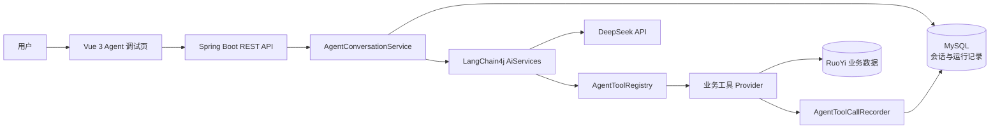

# RuoYi LangChain4j Agent

基于 RuoYi-Vue-Plus 与 LangChain4j 构建的企业后台智能体模块。项目将大模型对话、业务工具调用、会话持久化和执行链路观测接入现有权限管理系统，形成可配置、可追踪、可扩展的 Agent MVP。

[](https://www.oracle.com/java/)
[](https://spring.io/projects/spring-boot)
[](https://docs.langchain4j.dev/)
[](https://vuejs.org/)
[](LICENSE)

> 本项目是在 [RuoYi-Vue-Plus](https://github.com/dromara/RuoYi-Vue-Plus) 和 [plus-ui](https://github.com/JavaLionLi/plus-ui) 基础上完成的二次开发，重点展示 LangChain4j Agent 在真实后台业务中的工程化落地。

## 项目亮点

- **Agent 配置化**：可在后台维护 Agent 名称、模型、系统提示词、温度、最大 Token、启停状态和工具开关。
- **真实大模型接入**：通过 LangChain4j 的 OpenAI-compatible 客户端调用 DeepSeek，默认模型为 `deepseek-v4-pro`。
- **自然语言调用业务工具**：模型根据用户意图自主选择 `@Tool`，无需在前端硬编码命令分支。
- **工具注册与白名单**：Spring 工具实现、数据库工具定义和 Agent 工具授权三层解耦，不同 Agent 可拥有不同能力。
- **完整会话持久化**：会话、用户消息、模型回复、工具参数、工具结果和运行日志均写入 MySQL。
- **执行链路可观测**：记录模型、请求、响应、成功状态、异常信息、总耗时和工具耗时，并在前端展示运行详情。
- **复用系统安全边界**：沿用 Sa-Token 权限、多租户字段和当前用户会话，限制会话及日志的数据访问范围。

## Agent 架构



一次聊天请求的主要流程：

1. 校验当前用户是否有权访问会话，并读取启用状态下的 Agent 配置。
2. 从数据库恢复最近 20 条消息，构建 LangChain4j `ChatMemory`。
3. 根据 Agent 工具白名单，将允许使用的工具动态注册到 `AiServices`。
4. DeepSeek 判断直接回答或调用业务工具，工具结果再交给模型组织最终回复。
5. 持久化消息、工具轨迹和执行日志；失败时同样记录耗时与异常信息。

## 已实现功能

| 模块 | 功能 |
| --- | --- |
| Agent 配置 | 配置 CRUD、模型参数、系统提示词、状态与工具开关 |
| Agent 调试 | Agent 选择、会话创建、历史消息、非流式聊天、滚动对话窗口 |
| 会话记忆 | 从持久化消息恢复上下文，按会话隔离记忆 |
| 工具治理 | 工具定义、Spring Provider 注册、Agent 白名单授权、启停控制 |
| 执行记录 | 请求与响应、模型信息、状态、异常、耗时及完整调用轨迹 |
| 权限集成 | Agent 菜单权限、接口权限、用户会话归属与多租户字段 |

### 内置业务工具

| 工具编码 | 能力 | 类型 |
| --- | --- | --- |
| `system_user_count` | 统计当前租户中的正常系统用户数量 | 只读 |
| `system_user_search` | 按部门、用户名、昵称和状态查询当前操作者可见的用户 | 只读 |

新增工具时，实现 `AgentToolProvider`，在方法上使用 LangChain4j 的 `@Tool` 和 `@P` 描述能力及参数。Spring 会自动收集 Provider，`AgentToolRegistry` 再按照数据库白名单决定是否暴露给指定 Agent。

## 数据模型

| 表名 | 用途 |
| --- | --- |
| `agent_config` | Agent 基础配置与模型参数 |
| `agent_tool_definition` | 工具元数据、风险等级与状态 |
| `agent_config_tool` | Agent 与工具的授权关系 |
| `agent_session` | 用户会话及最后活跃时间 |
| `agent_message` | user、assistant、tool 消息及工具轨迹 |
| `agent_run_log` | 每次 Agent 执行的请求、响应、状态、异常和耗时 |

数据库初始化脚本位于 [`script/sql/update/add_agent_module.sql`](script/sql/update/add_agent_module.sql)。

## 技术栈

| 层次 | 技术 |
| --- | --- |
| Agent 编排 | LangChain4j 1.17.2、AiServices、ChatMemory、Tool Calling |
| 模型服务 | DeepSeek OpenAI-compatible API |
| 后端 | Java 17、Spring Boot 3.5、MyBatis-Plus、Sa-Token |
| 前端 | Vue 3、TypeScript、Vite、Element Plus、Pinia |
| 数据与基础设施 | MySQL 8、Redis 7、MinIO、Docker Compose |

## 项目结构

```text
RuoYi-Vue-Plus/
├── plus-ui/                         # Vue 3 前端
│   └── src/views/agent/             # 配置、调试、执行记录页面
├── ruoyi-admin/                     # 后端启动模块
├── ruoyi-modules/
│   └── ruoyi-agent/                 # LangChain4j Agent 业务模块
│       └── src/main/java/org/dromara/agent/
│           ├── config/              # DeepSeek 与 LangChain4j 配置
│           ├── controller/          # Agent REST 接口
│           ├── domain/              # Entity、BO、VO
│           ├── provider/            # ChatModel 工厂
│           ├── service/             # 会话编排与持久化
│           └── tool/                # 工具注册、执行与轨迹记录
├── script/sql/update/               # Agent 数据库脚本
├── compose.dev.yml                  # 本地开发环境编排
└── LOCAL_ENV.md                     # 本地环境补充说明
```

## 快速启动

### 1. 环境要求

- Docker Desktop
- Node.js `>= 20.19.0`
- DeepSeek API Key
- 可选：本机 JDK 17/21 与 Maven 3.9+

### 2. 配置 API Key

在项目根目录创建不会提交到 Git 的 `.env`：

```dotenv
DEEPSEEK_API_KEY=your-api-key
```

API Key 只由后端环境变量读取，不写入数据库，也不会返回给前端。

### 3. 构建后端

本机已安装 Maven 时：

```powershell
mvn -P local -DskipTests package
```

没有本地 Java/Maven 时，可使用 Docker 构建：

```powershell
docker run --rm -v "${PWD}:/workspace" -v ruoyi-m2:/root/.m2 -w /workspace maven:3.9.11-eclipse-temurin-17 mvn -P local -DskipTests package
```

### 4. 启动后端与基础设施

```powershell
docker compose -f compose.dev.yml up -d
```

首次使用空数据目录时，MySQL 会自动导入 RuoYi 与 Agent SQL。已有数据库需要单独执行：

```text
script/sql/update/add_agent_module.sql
```

后端地址：`http://localhost:8080`

### 5. 启动前端

```powershell
cd plus-ui
npm install
npm run dev
```

前端地址：`http://localhost`，开发环境通过 `/dev-api` 代理后端 `8080` 端口。

### 6. 验证 Agent

1. 登录系统并进入“智能体中心”。
2. 在“Agent 配置”中确认 Agent、模型和工具状态。
3. 在“Agent 调试”中新建会话并发送普通聊天消息。
4. 输入“请查询当前租户有多少正常用户，不要估算”，验证模型自主调用工具。
5. 在“执行记录”中检查模型响应、工具参数、工具结果与耗时。

停止本地环境：

```powershell
docker compose -f compose.dev.yml down
```

## 主要接口

| 方法 | 地址 | 说明 |
| --- | --- | --- |
| `GET` | `/agent/config/list`、`/agent/config/{id}` | Agent 配置列表与详情 |
| `POST/PUT/DELETE` | `/agent/config`、`/agent/config/{ids}` | 新增、修改与删除 Agent 配置 |
| `GET/POST` | `/agent/session/list`、`/agent/session` | 会话查询与创建 |
| `GET` | `/agent/message/list/{sessionId}` | 查询会话消息 |
| `POST` | `/agent/chat/send` | 发送聊天消息 |
| `GET` | `/agent/tool/list` | 查询可用工具 |
| `GET` | `/agent/run/list` | 查询执行记录 |
| `GET` | `/agent/run/{id}/trace` | 查询完整执行轨迹 |

## 当前边界与后续计划

- 当前只接入 DeepSeek Provider，Provider 层保留扩展其他 OpenAI-compatible 模型的空间。
- 当前聊天采用非流式响应，下一阶段可增加 SSE 流式输出和中断生成。
- 当前业务工具以只读查询为主；新增用户等写操作需要加入参数校验、风险分级、二次确认和审计策略。
- 可继续增加菜单、角色、操作日志等领域工具，以及 RAG 知识库和 Agent 自动评测。

## 开源说明

本项目遵循仓库中的 [MIT License](LICENSE)。感谢 RuoYi-Vue-Plus、plus-ui 和 LangChain4j 社区提供的优秀开源项目。
